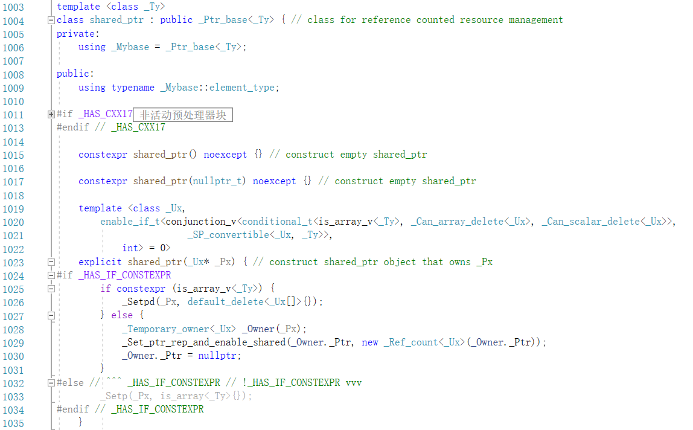
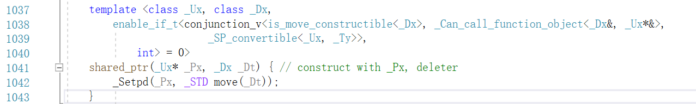
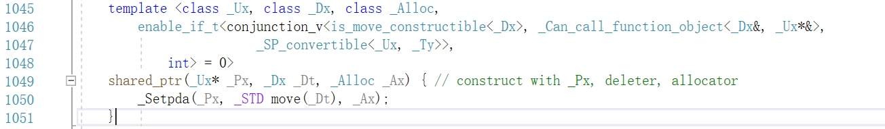

## 探究share_ptr的底层实现

首先我们写

>class A
>
>{
>}
>
>int main()
>{
>    std::cout << "Hello World!\n";
>    shared_ptr<A> a;
>}
>
>

然后ctrl+click进入shared_ptr


>
>
>是长这样的

展开后发现继承了class shared_ptr : public _Ptr_base<_Ty> 


我们先直接看share_ptr 遇到没见过的成员再去看基类

### 1 总体概况


>没啥, using 那句话用法就是
>
>```
>using db =double
>
>db a=1.25
>
>
>```
>
>constexpr 就是 const + expression
>
>编译时期确定的表达式
>
>可以看到注释是 空的构造函数
>
>

### 2 构造函数探秘


那么接下来在那两个空的构造函数后面的这个template有一大堆的就是真正的构造函数了 然后template里面主要有

template里面的东西不是很关心 主要关心构造函数, 但是还是大概看一下

>enable_if_t 我猜应该是if(ptr) 这种吧
>
>
>
>conjunction_v 和连接有关的什么
>
>
>
>is_array_v _Can_array_delete
>
>应该是因为delete 和delete [] 有区别吧
>
>_Can_scalar_delete _SP_convertible就不知道是啥了 暂时忽略

ok ,接下来看函数体

大概结构就是这样

>```
>template< >
>explicit shared_ptr(_Ux* _Px) { 
>
>}
>```
>
>看到有一行注释
>
>// construct shared_ptr object that owns _Px

所以猜测 px就是那个真正的指针

接下来看代码

>

>一行一行看
>
>_Temporary_owner<_Ux> _Owner(_Px);
>
>创建了一个临时拥有px的owner对象
>
>_Set_ptr_rep_and_enable_shared(_Owner._Ptr, new _Ref_count<_Ux>(_Owner._Ptr));
>
>创建一个_Ref_count对象

这时候发现和刚才我们忽略的Temporary_owner联系紧密

### 3.Temporary_Owner

幸运的是,这个类非常简短


>### 一行一行看
>
>_Ux* _Ptr;
>
>首先类成员有一个_Ptr
>
>### 然后这是构造函数
>
>explicit _Temporary_owner(_Ux* const _Ptr_) noexcept : _Ptr(_Ptr_) {}
>
>无非就是把传进来的东西赋给了刚才_Ptr
>
>### 然后这两行有点看不懂 什么=delete
>
>_Temporary_owner(const _Temporary_owner&) = delete;
>    _Temporary_owner& operator=(const _Temporary_owner&) = delete;
>
>然后一查 是C++11 新特性
>
>https://www.ibm.com/developerworks/cn/aix/library/1212_lufang_c11new/index.html
>
>可以看看这个 或者我直接说
>
> 对于 C++ 的类，如果程序员没有为其定义特殊成员函数，那么在需要用到某个特殊成员函数的时候，编译器会隐式的自动生成一个默认的特殊成员函数，比如拷贝构造函数，或者拷贝赋值操作符。 
>
>但是在某些情况下，假设我们不允许发生类对象之间的拷贝和赋值，可是又无法阻止编译器隐式自动生成默认的拷贝构造函数以及拷贝赋值操作符，那这就成为一个问题了。
>
>### Deleted 函数的提出
>
> 为了能够让程序员显式的禁用某个函数，C++11 标准引入了一个新特性：deleted 函数。程序员只需在函数声明后加上“`=delete;`”，就可将该函数禁用。例如，我们可以将类 `X` 的拷贝构造函数以及拷贝赋值操作符声明为 deleted 函数，就可以禁止类 `X` 对象之间的拷贝和赋值。
>
>```
>class X{            
>     public: 
>       X(); 
>       X(const X&) = delete;  // 声明拷贝构造函数为 deleted 函数
>       X& operator = (const X &) = delete; // 声明拷贝赋值操作符为 deleted 函数
>     }; 
>     
>     
>```
>
>所以 _Temporary_owner 这个类就是ban掉了拷贝赋值函数和 拷贝构造函数 
>
>_Temporary_owner 临时的主人嘛
>
>### 最后
>
>### 就是析构函数了
>
>~_Temporary_owner() {
>        delete _Ptr;
>    }
>
>没什么好说的, OK 我们已经看完_Temporary_owner 类了

### 4.回到share_ptr的构造函数

现在我们知道了_Temporary_owner 就是个工具人


再回看这段代码 还有哪里有疑惑呢

可能就是最关键的_Ref_count了

### 5.看_Ref_count

谢天谢地,_Ref_count也非常简短


> 老规矩 一行一行看
>
> ### 声明
>
> template <class _Ty>
> class _Ref_count : public _Ref_count_base { // handle reference counting for pointer without deleter
>
> 继承了_Ref_count_base 那么我们待会肯定要看这个类了
>
> ### 一个私有成员
>
>  _Ty* _Ptr;
>
> ### 构造函数
>
> explicit _Ref_count(_Ty* _Px) : _Ref_count_base(), _Ptr(_Px) {}
>
> 调用了父类_Ref_count_base()的构造函数
>
> _Ptr(_Px)然后还给私有成员_Ptr赋值
>
> ### 析构管理的资源
>
>  virtual void _Destroy() noexcept override { 
>         delete _Ptr;
>     }
>
> // destroy managed resource
>
> ### 析构自身
>
> virtual void _Delete_this() noexcept override { 
>         delete this;
>     }
>
> // destroy self

### 6.看_Ref_count_base

好了, 我们要看一个很关键的类了

我猜所有智能指针的引用技术都是继承它的

非常不幸,这玩意非常长

先看个概况吧


展开后,

我们继续来分析


>### 折叠 非活动预处理器模块
>
>不看
>
>### 两个虚函数 =0表示是纯虚函数嘛
>
>要求子类实现
>
>刚才我们看的_Ref_count对这两个函数进行了实现 没问题
>
>那noexcept 什么意思呢
>
>查了资料
>
> 从C++11开始，我们能看到很多代码当中都有关键字noexcept。比如下面就是std::initializer_list的默认构造函数，其中使用了noexcept。  该关键字告诉编译器，函数中不会发生异常,这有利于编译器对程序做更多的优化。 
>
>更多用法就不讨论了
>
>### 两个_Atomic_counter_t
>
>_Atomic_counter_t _Uses  = 1;
>   _Atomic_counter_t _Weaks = 1;
>
>看名字就知道应该是原子的东西, 可能考虑到多线程对count的访问问题
>
>然后我抱着好奇心一看
>
>
>
>索然无味,原来并没有实现原子性 可能还要我们加锁

继续看下一部分


>
>
>### 到了构造函数部分
>
>
>
>```
>protected:
>    constexpr _Ref_count_base() noexcept = default; // non-atomic initializations
>
>public:
>    _Ref_count_base(const _Ref_count_base&) = delete;
>    _Ref_count_base& operator=(const _Ref_count_base&) = delete;
>
>```
>
>
>
>这个和 =delete很像
>
>##### Defaulted 函数的提出
>
> 为了解决两个问题：1. 减轻程序员的编程工作量；2. 获得编译器自动生成的默认特殊成员函数的高的代码执行效率，C++11 标准引入了一个新特性：defaulted 函数。程序员只需在函数声明后加上“`=default;`”，就可将该函数声明为 defaulted 函数，编译器将为显式声明的 defaulted 函数自动生成函数体。
>
>后面两个也是ban掉拷贝构造函数和拷贝赋值函数
>
>### 这个析构函数
>
>virtual ~_Ref_count_base() noexcept {} // TRANSITION, should be non-virtual
>
>翻译一下: 过渡 应该是非虚函数
>
>是还没做好的意思吗hhh


### 最重要的引用计数增加


> 函数返回值是bool
>
> 成功就返回true
>
> ```
> auto& _Volatile_uses = reinterpret_cast<volatile long&>(_Uses);
> long _Count          = _ISO_VOLATILE_LOAD32(_Volatile_uses);
> 
> ```
>
> 这俩行是把类型转换一下 reinterpret_cast是啥我也不知道
>
> 查了大概了解一下
>
>  reinterpret_cast运算符是用来处理无关类型之间的转换；它会产生一个新的值，这个值会有与原始参数（expressoin）有完全相同的比特位。 
>
> _ISO_VOLATILE_LOAD32这玩意就和编译器所在系统的架构有关了 不是我们关注的地方
>
> ok 现在来看while循环
>
> ```
> const long _Old_value = _INTRIN_RELAXED(_InterlockedCompareExchange)(&_Volatile_uses, _Count + 1, _Count);
> ```
>
> 这话话的
>
> _InterlockedCompareExchange是关键
>
> 我们看一下_InterlockedCompareExchange的源码
>
> ```
> __MACHINE(long __MACHINECALL_CDECL_OR_DEFAULT _InterlockedCompareExchange(long volatile * _Destination, long _Exchange, long _Comparand))
> 
> ```
>
> 简单来说 InterlockedCompareExchange属于Interlocked系列互锁函数之一，常用于多线程编程。 
>
>  **InterlockedCompareExchange**是把目标操作数（第1参数所指向的内存中的数）与一个值（第3参数）比较，如果相等，则用另一个值（第2参数）与目标操作数（第1参数所指向的内存中的数）交换； 
>
> 返回值是原始值
>
> 这样我们就知道前面为什么要那两句话了
>
> ```
>  if (_Old_value == _Count) {
>                 return true;
>             }
> 
>             _Count = _Old_value;
> ```
>
> 如果 由_InterlockedCompareExchange返回的值赋值给了_Old_value
>
> 如果_Old_value == _Count 说明没有其他线程在此期间修改
>
> 我们返回true
>
> 否则 就把count返回到old_value
>
> 秒阿

### _Ref_count_base的其他部分


分别是增加use和weak的


这个用来减引用计数 并且如果变成0 会调用析构


这个减weak


这个会返回User_count


这个暂时不知道干嘛

### OK,到这里我们已经看完_Ref_count_base的所有代码

### 我们现在在哪? 我们现在在递归函数的最深层 现在该回头 退出栈了 我们已经拥有了很多知识 不妨重新开始看

### 二.新的开始

### 一.构造函数



回顾一下 1035行之前的我们已经看过了

我们接着看



有deleter的构造函数

emm让人想起了STL的alloater



话刚说完 allocater来了

#### 一直到1102行 都是各种各样的构造函数 从weak_ptr转换的阿什么的, 

#### 害 ,平时用的时候老是抱怨怎么没有实现这个到这个的重载, 现在看源码知道了开发者的痛苦 数了一下 一共16个构造函数

### 二.析构函数

```

    ~shared_ptr() noexcept { // release resource
        this->_Decref();
    }
```


# 本篇最重要的内容

既然讲到了析构,我们来讲一下析构链,这一大堆析构函数到底是怎么执行的

```
class B {
public:
    ~B() {
        std::cout << "~B\n";
    }
};

class D : public B {
public:
    ~D() {
        std::cout << "~D\n";
    }
};

int main() {

    std::shared_ptr<B> shared_pointer = std::shared_ptr<B>(new D());//注意
    //我们new的是D
    shared_ptr = nullptr;


    return 0;
}

```


**先上主要类的结构**

```C++
template <>
class _Ptr_base<B> {
    //...

private:
    B* _Ptr;
    _Ref_count_base* _Rep;
}

template <>
class _Ref_count<D> : public _Ref_count_base {
public:
    explicit _Ref_count(D* _Px) : _Ref_count_base(), _Ptr(_Px) {}

private:
    // 最后析构函数会调用到这里
    virtual void _Destroy() noexcept override {
        delete _Ptr;
    }

    D* _Ptr;
};

template <>
class shared_ptr<B> : public _Ptr_base<B> {
    explicit shared_ptr(D* _Px) {
        _Ptr = _Px; // _Ptr 静态类型是 B，但保存 new D() 的裸指针
        _Rep = new _Ref_count<D>(_Px) // _Ref_count 是 _Ref_count_base 的子类，该类保存了一个指向 D 的指针
    }
}

```


> `std::shared_ptr`在构造函数中做了两件事，初始化了两个数据成员。因为要克服重重障碍，无法直接放在初始化列表中进行。这也就是**引用计数与托管对象的分离**实现案例。 
>
> 1.`std::shared_ptr`中保存了裸指针（没错，它的静态类型是`B`，但没有`virtual`是不能正确析构的）
>
>​	B* _Ptr;  也就是这行
>
>
>
>2.以及一个`_Ref_count`结构，它借由模板构造函数窃取到了实际的指针信息，即`D`的信息(我们new的是D)

**来了**

```
// 析构函数调用链

~shared_ptr() noexcept {
    this->_Decref();
}

void _Ptr_base::_Decref() noexcept {
    if (_Rep) {
        _Rep->_Decref(); // 析构链转入 _Ref_count_base，和父类已经没关系了...
    }
}

void _Ref_count_base::_Decref() noexcept {
    if (_MT_DECR(_Uses) == 0) {
        _Destroy();
        //注意这里在前面我们看过,这里在基类也就是_Ref_count_base本类中是纯虚函数
        所以会跳到下面那个
        _Decwref();
    }
}


//跳到这里
virtual void _Ref_count::_Destroy() noexcept override {
    delete _Ptr; // 这是指向 D 的指针
}

```


> ```
>template <>
>class _Ptr_base<B> {
>    //...
>
>private:
>    B* _Ptr;
>    _Ref_count_base* _Rep;
>}
>
> ```
>
>
>
> **最后销毁的是子类的指针，即使没有用`virtual`，但借由模板准确获取到了静态类型。**
>
>析构时居然完全不管share_ptr两大成员之一的`_Ptr`，只析构引用计数`_Rep`，其实原因在构造函数中很清楚，
>
>`_Ptr`的生命周期由引用计数托管。
>
>另外，`_Ref_count_base::_Decref()`中还有一个`_Decwref();`，这个是判断`std::weak_ptr`还在不在的。如果还在的话，虽然指针对象销毁了，引用计数对象`_Ref_count`还在的，因为得让`std::weak_ptr`查询，如果连`std::weak_ptr`都没有了，引用计数就把自己也销毁。

